% Installation d'un OS sur un serveur distant sans KVM

# Installation d'un système d'exploitation sur un serveur distant ne disposant pas de KVM

> Dans ce cas précis je vais devoir vérfier le disque et le reformater, c'est ici une réinstallation suite à l'échec de montage de certaines partitions.
>
> Facultatif donc mais ça pourrait vous servir un jour.

## Installation via QEMU

### Mode secours

* Redémarrer votre serveur en **mode rescue**
* OS utilisé ici : **Ubuntu 18.04**
* Connecté vous avec votre utilisateur et utiliser `sudo` devant les commandes ou passer en **root** `sudo -s`

### Préparation

#### Environnement de virtualisation

* **Installer l'environnement** : `apt update && apt install -y qemu-system`
    * Un petit peu de lecture ne peut pas faire de mal : `qemu-system-x86_64 --help`
    * Dans mon cas, version du logiciel :
       ```
       # qemu-system-x86_64 --version
       QEMU emulator version 2.11.1(Debian 1:2.11+dfsg-1ubuntu7.22)
       ```

#### Disque dur

> Ce qui suit est **spécifique à mon installation**, les résultats suivent ceux d'une installation antiéreur de XCP-ng

* **Sommaire des disques et partitions** :
    ```
    # lsblk
    NAME                                                                   MAJ:MIN RM   SIZE RO TYPE MOUNTPOINT
    loop0                                                                    7:0    0 484,6M  1 loop /lib/live/mount/rootfs/    img.current.squashfs
    sda                                                                      8:0    0 119,2G  0 disk ├─sda1                                                                   8:1    0    18G  0 part
    ├─sda2                                                                   8:2    0    18G  0 part
    │ └─XSLocalEXT--dce4e95a--43b3--73fb--4e6d--a113c3f9c687-dce4e95a--43b3--73fb--4e6d--a113c3f9c687
    │                                                                      253:0    0    18G  0 lvm
    ├─sda3                                                                   8:3    0  68,2G  0 part
    ├─sda4                                                                   8:4    0   512M  0 part
    ├─sda5                                                                   8:5    0     4G  0 part
    └─sda6                                                                   8:6    0     1G  0 part [SWAP]
    ```
* **Dans mon cas (facultatif ou en fonction de votre disque)**:
  * Désactiver la partition swap `swapoff /dev/sda6`
  * Détruire le VG `vgremove XSLocalEXT-dce4e95a-43b3-73fb-4e6d-a113c3f9c687`
  * Détruire le LVM label `pvremove /dev/sda2`
  * Détruire les partitions avec `parted` ou `fdisk /dev/sda`
    * Utiliser `partprobe` si nécéssaire
    * Si nécéssaire rebooter
* **Déterminer le disque à utiliser** :
   ```
   # lsblk
   NAME  MAJ:MIN RM   SIZE RO TYPE MOUNTPOINT
   loop0   7:0    0 484,6M  1 loop /lib/live/mount/rootfs/img.current.squashfs
   sda     8:0    0 119,2G  0 disk
   ```
   * Ici donc : `/dev/sda`

#### ISO XCP-ng

* **Déterminer l'emplacement où placer l'ISO d'XCP-ng** :
   * Ici `/tmp` nous fournit la place suffisante
      ```
      # df -h
      Filesystem      Size  Used Avail Use% Mounted on
      udev            1,9G     0  1,9G   0% /dev
      tmpfs           395M  544K  394M   1% /run
      /dev/loop0      485M  485M     0 100% /lib/live/mount/rootfs/img.current.squashfs
      tmpfs           2,0G     0  2,0G   0% /lib/live/mount/overlay
      overlay         2,0G  926M  1,1G  47% /
      tmpfs           2,0G     0  2,0G   0% /dev/shm
      tmpfs           5,0M     0  5,0M   0% /run/lock
      tmpfs           2,0G     0  2,0G   0% /sys/fs/cgroup
      tmpfs           2,0G     0  2,0G   0% /tmp
      tmpfs           395M     0  395M   0% /run/user/1000
      ```
* **Télécharger le dernier ISO d'XCP-ng en date** :
   * `wget -O /tmp/xcp-ng.iso http://mirrors.xcp-ng.org/isos/8.0/xcp-ng-8.0.0.iso`
   * Vérifier le checksum : `sha256sum /tmp/xcp-ng.iso`
#### Déterminer la ou les interfaces et celle à attribuer à eth0 pour l'interface de management :
> Etape importante pour obtenir un ping au reboot, faire attention avec la NIC offert par QEMU
* `ip l` :
    ```
    # ip l
    1: lo: <LOOPBACK,UP,LOWER_UP> mtu 65536 qdisc noqueue state UNKNOWN mode DEFAULT group default qlen 1000
        link/loopback 00:00:00:00:00:00 brd 00:00:00:00:00:00
    2: enp1s0: <BROADCAST,MULTICAST,UP,LOWER_UP> mtu 1500 qdisc mq state UP mode DEFAULT group default qlen 1000
        link/ether 00:08:a2:0c:80:02 brd ff:ff:ff:ff:ff:ff
    ```
* Ici : `00:08:a2:0c:80:02`

#### Installer sur votre ordinateur un client VNC
* J'utilise **remmina** sous Linux

#### Récapitulatif
* Disque : `/dev/sda`
* ISO : `/tmp/xcp-ng.iso`
* MAC : `00:08:a2:0c:80:02`
> Minimum de 2Go de RAM disponible pour booter l'ISO XCP-ng

### Lancer la machine virtuelle
> Modifier les valeurs en fonction de vos propres paramètres
* `qemu-system-x86_64 -enable-kvm -localtime -enable-kvm -vnc 0.0.0.0:0 -m 2048M -drive file=/dev/sda,format=raw,cache=none,index=0,media=disk -net nic,macaddr=00:08:a2:0c:80:02 -cdrom /tmp/xcp-ng.iso -boot d`

### Se connecter avec VNC
* Utiliser l'IP de votre dédié, protocole VNC, pas de password
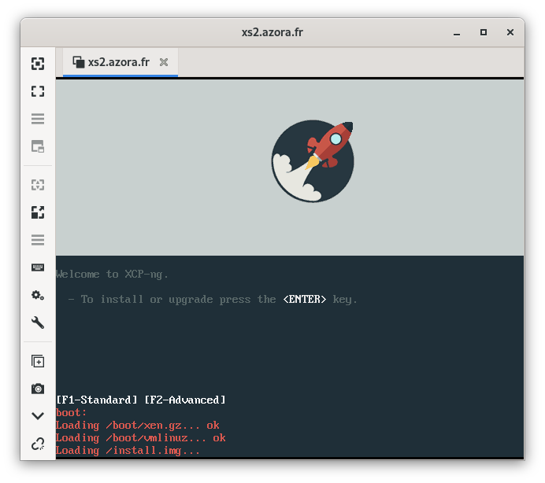

## Parcourir l'installation
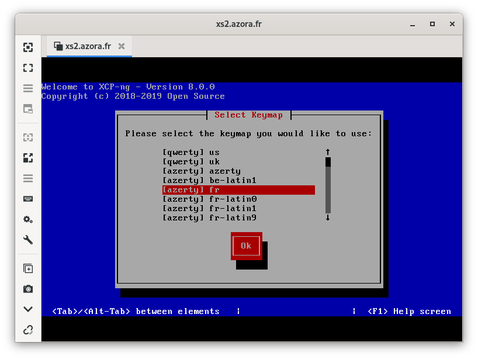
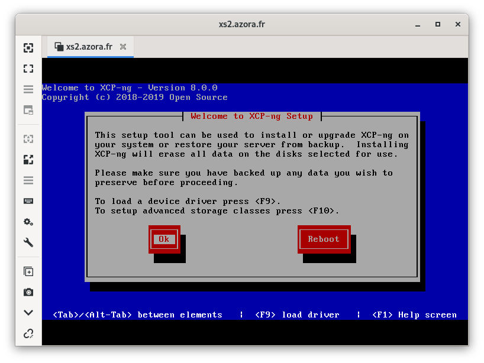
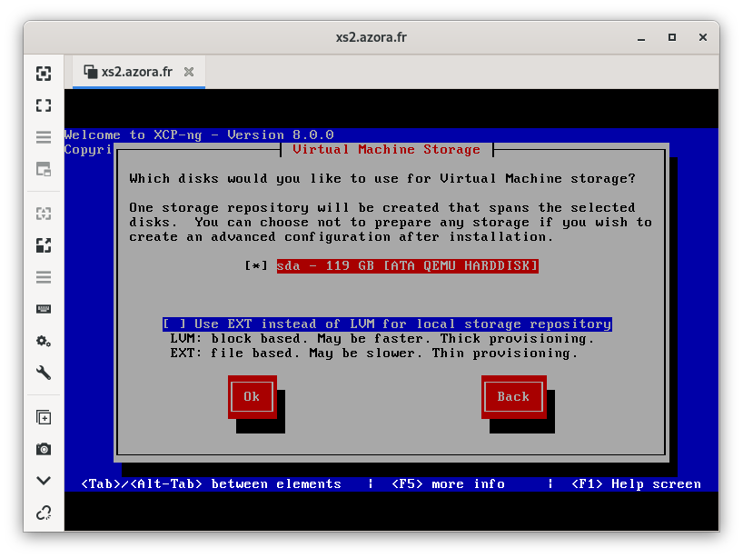
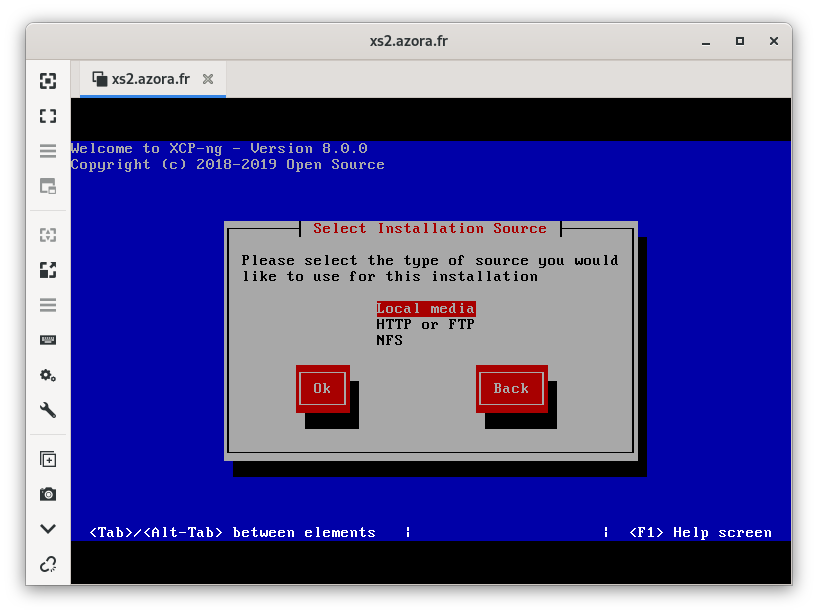
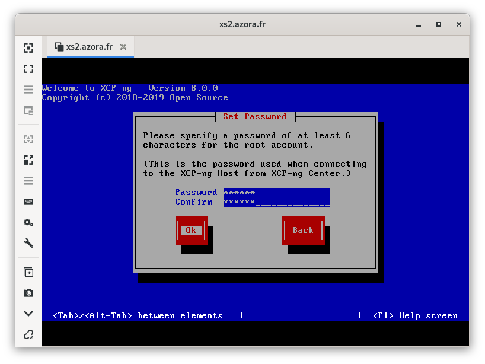
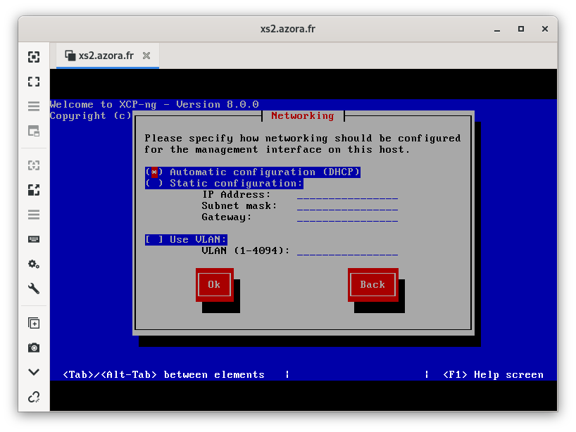
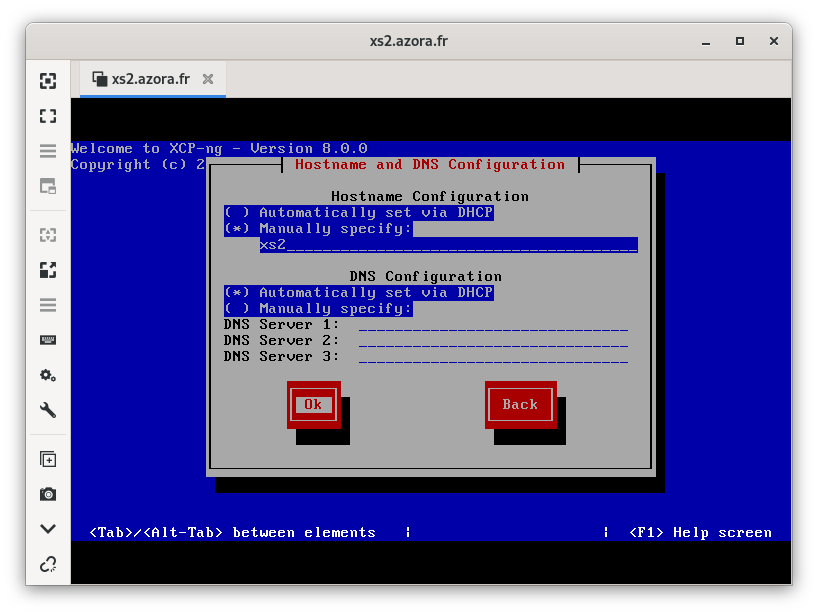
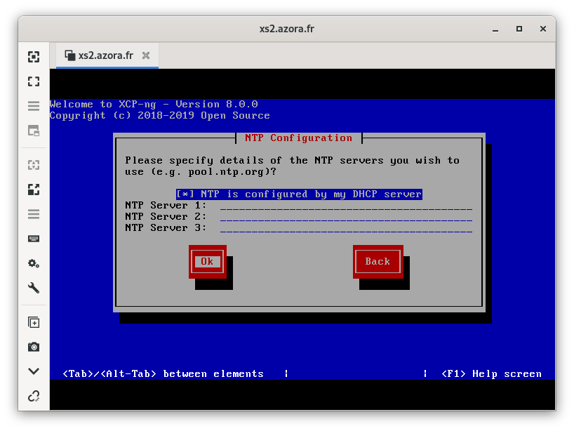
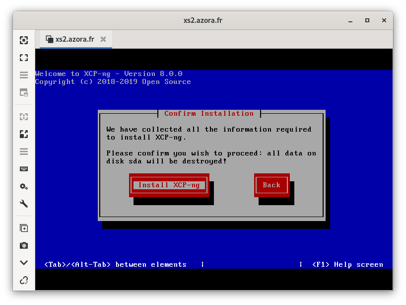
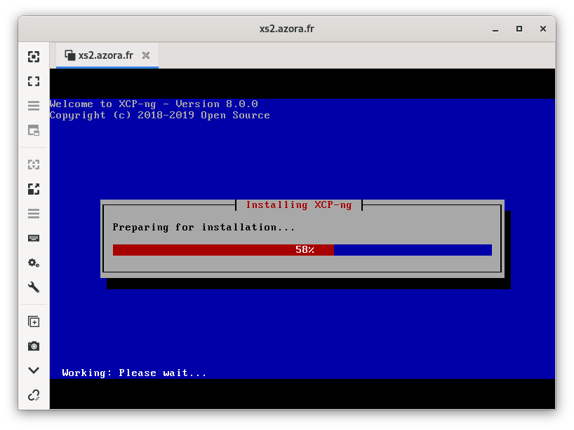
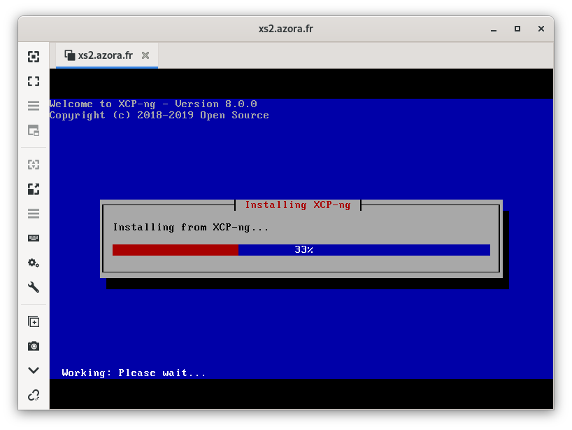

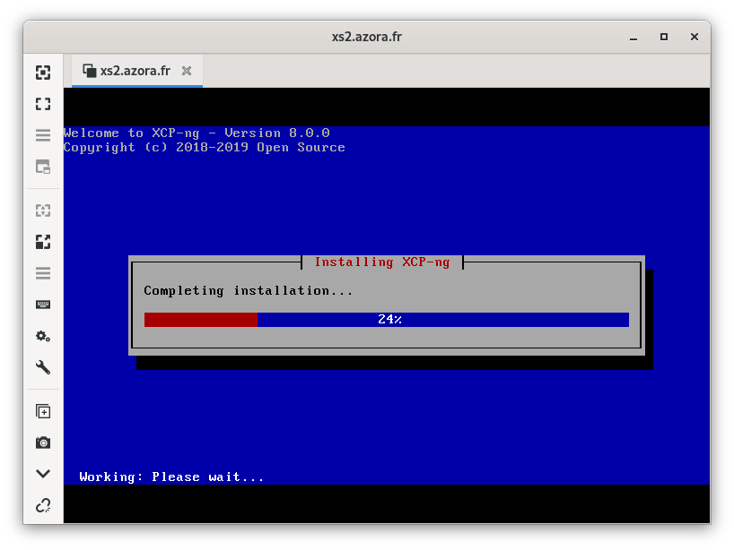
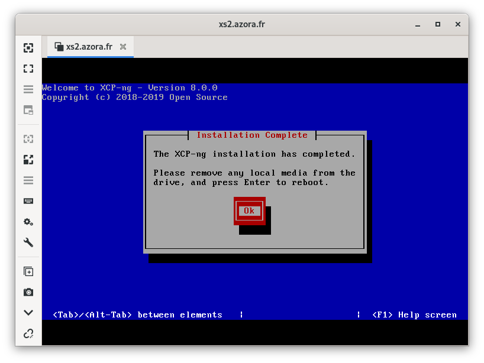
> Après le rédémarrage sur l'ISO vous pouvez éteindre la VM (`CTRL-c` dans le terminal)

## Enjoy
* Rebooter en mode normal

## Bonus : Xen Orchestra
